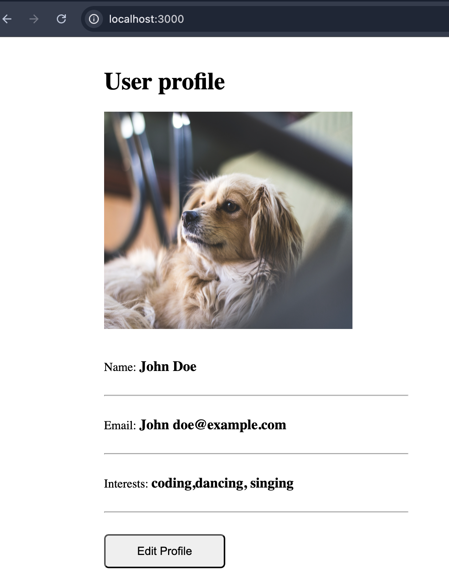
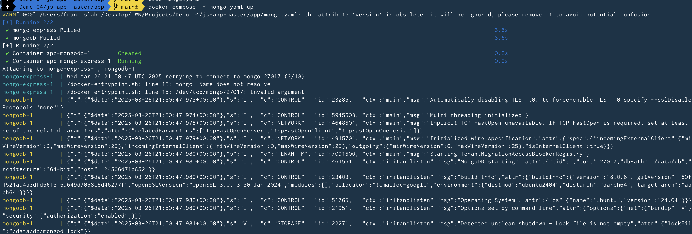
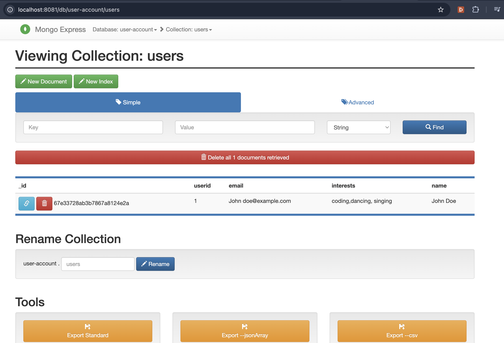
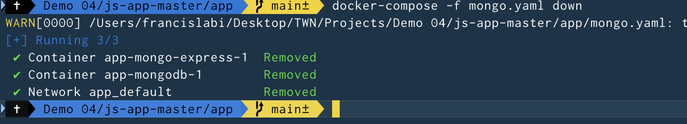

# DevOps Project 04
In this project, I Docker Compose to run multiple Docker containers

### Technologies used:
Docker, Node.js, MongoDB, MongoExpress

### Completed Tasks:
- Wrote a Docker Compose file (mongo.yaml) to run ongoDB and
MongoExpress containers

- Ran Nodejs application in Docker container connected to
MongoDB database and MongoExpress container as a UI of the MongoDB
database.

