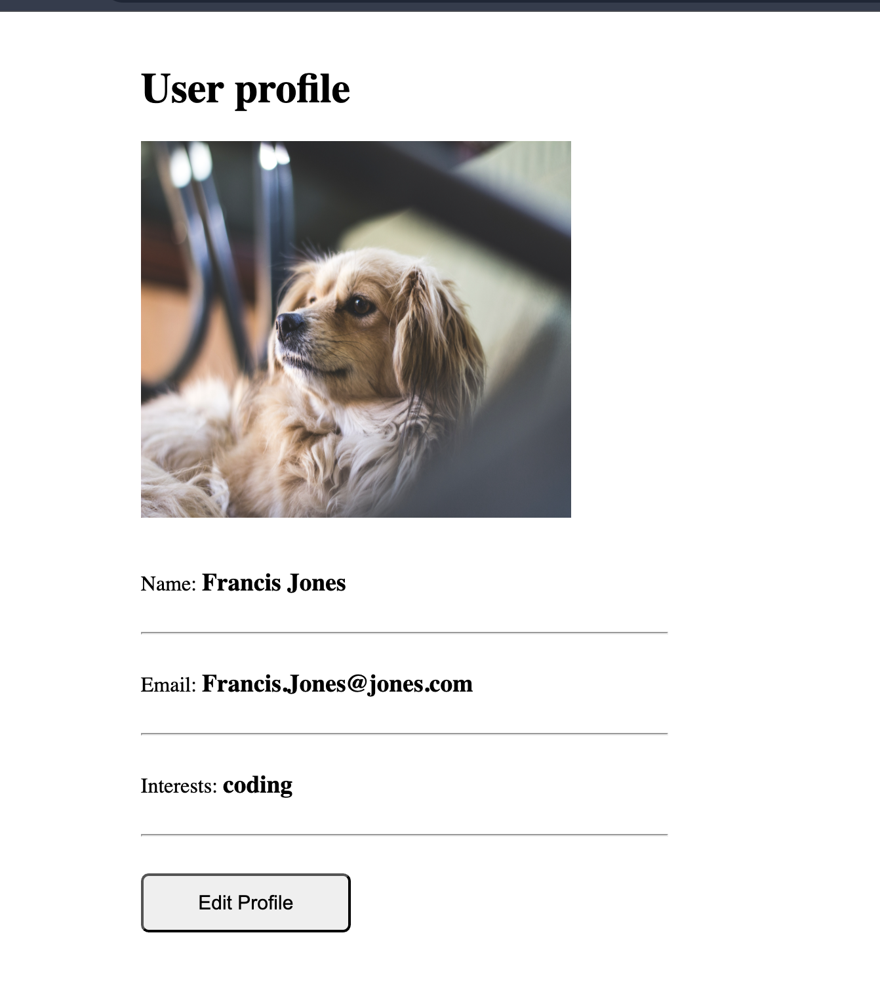
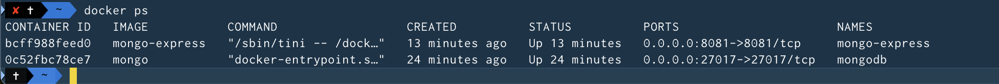
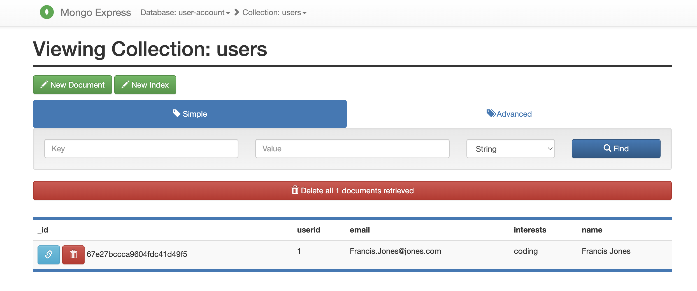

# DevOps Project 03
In this project, I used Docker for local development

### Technologies used:
Docker, Node.js, MongoDB, MongoExpress

### Completed Tasks:

- Ran Nodejs application in Docker container and connected to
MongoDB database container locally.

- Ran MongoExpress container as a UI of the MongoDB
database.

